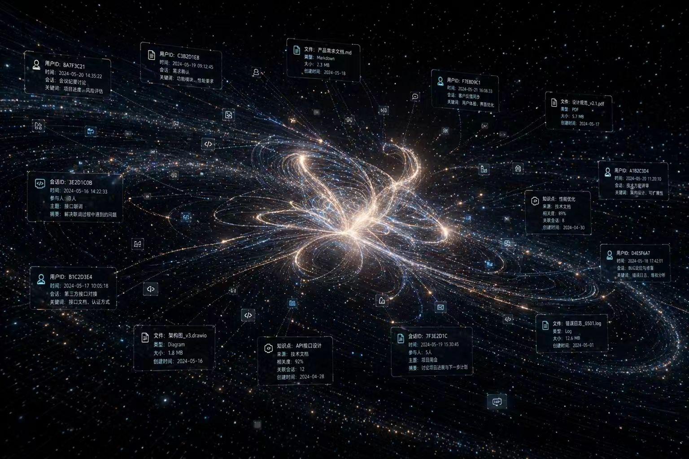
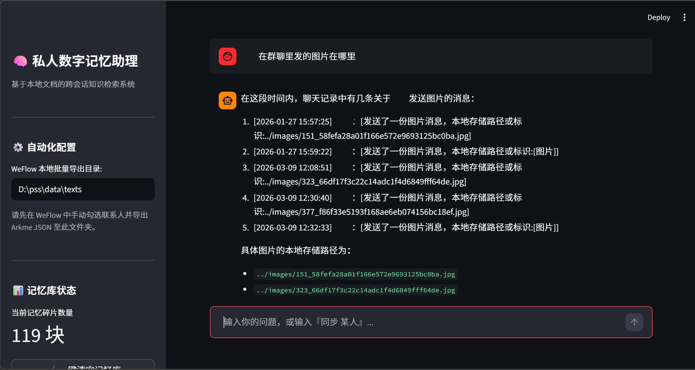
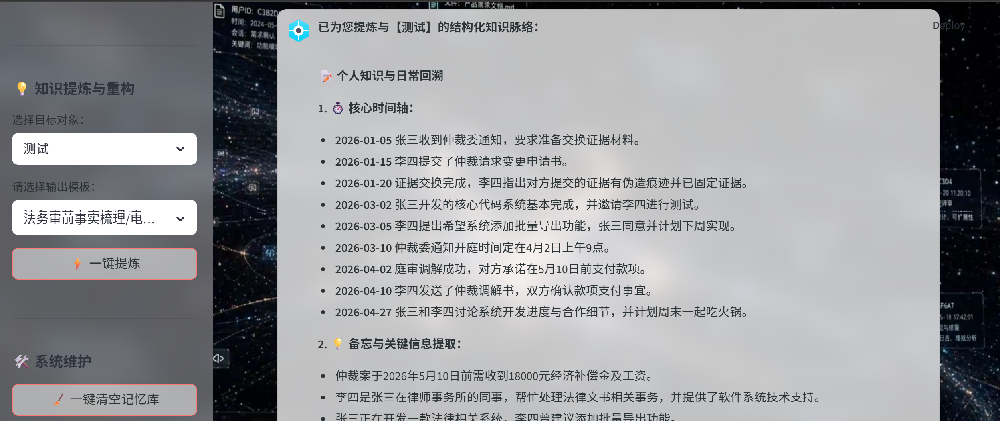

<div align="center">
  
  <h1>MemoraOS —— 端侧记忆认知系统</h1>
  <p>面向法务取证、科研协作与个人数字资产的端侧 AI 审计中枢</p>

  [](https://www.python.org/)
  [](https://ollama.com/)
  [](LICENSE)
</div>

---

## 💡 项目背景与理念

在数字化时代，个人与商业机密高度集中于即时通讯软件与本地文档中。传统的云端 AI 知识库（如 ChatGPT、Notion AI）要求用户全量上传隐私数据，存在严重的数据泄露与合规风险。

**MemoraOS** 从“数据主权应归于个人”的核心价值观出发，构建了一套**可断网运行、100%本地计算**的 RAG（检索增强生成）操作系统。通过搭载端侧轻量级大模型（如 Qwen2.5:7b），旨在打破异构数据的格式孤岛，将杂乱的聊天记录化为结构化的知识脉络。

## ✨ 核心亮点 (Core Features)

- 🛡️ **绝对的数据主权**：向量嵌入（BGE-m3）、数据库检索（ChromaDB）与大模型推理全链路本地运行，零数据外泄。
- ⏳ **动态时序防破碎聚类**：引入基于消息时间差（Δt）的动态上下文切片算法，保全多轮对话、问答、协商的逻辑因果链。
- 👁️‍🗨️ **跨模态降维锚定定位**：无需高昂的视觉算力，通过绝对路径标签化，实现“自然语言提问 -> 操作系统级图片/文件秒级定位与渲染”。
- 🧠 **实体隔离思维链 (Entity-Isolated CoT)**：通过底层强约束提示词，解决轻量级端侧模型在处理多人长对话时极易发生的“角色混淆”与“指代张冠李戴”问题。
- 📊 **FaaS 场景化模板驱动**：一键将闲聊记录萃取为《法务审前事实梳理（时间轴）》、《科研项目待办脉络》等 Markdown 结构化报告。

## 📸 系统预览


|                   跨模态图片渲染                    |             AI 思维链透明展示 & 结构化知识萃取             |
|:--------------------------------------------:|:--------------------------------------------:|
|  |  |

## 🚀 快速开始

### 1. 环境准备
- 操作系统：Windows 10/11 
- 基础环境：[Python 3.10+](https://www.python.org/) 
- 本地模型引擎：下载并安装 [Ollama](https://ollama.com/)

### 2. 获取源码
```bash
git clone https://github.com/iug-cy/pss.git
cd pss
```

### 3. 一键部署环境 (Windows)
双击运行根目录下的 deploy.bat。脚本将自动：
- 创建独立的 Python 虚拟环境
- 极速拉取国内镜像源依赖 (requirements.txt)
- 自动下载 BAAI/bge-m3 Embedding模型到本地

### 4. 唤醒系统
双击运行 run_server.bat（或使用 MemoryOS.vbs 静默启动后台）。
系统将自动初始化多源异构转换引擎，并在浏览器 http://localhost:8501 启动交互面板。

## 🛠️ 技术架构

```
MemoraOS
├── 数据接入层 : WeFlow API 适配器 / 本地 JSON/DOCX 解析器
├── 向量基建层 : ChromaDB + BAAI/bge-m3 Embedding
├── 认知中枢层 : NLP 时间意图解构 + 双轨混合检索
├── 逻辑生成层 : Ollama (Qwen2.5) + Entity-Isolated CoT 约束
└── 交互表现层 : Streamlit 响应式 Web 大屏
```

---