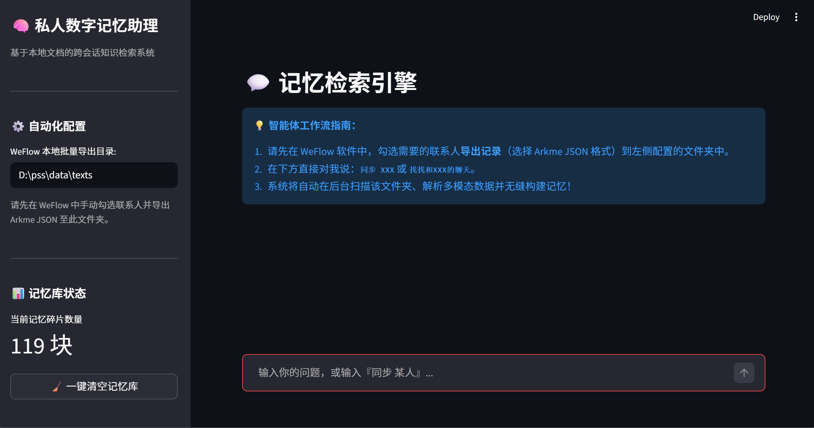

# 私人微信聊天记录搜索引擎

基于 RAG 的本地微信聊天记录语义搜索系统。

支持：
- WeFlow API 自动抓取聊天记录
- 本地 JSON / CSV / DOCX 导入
- 向量检索
- Ollama 大模型问答
- Web UI


---

# 环境要求

- Python 3.10
- Ollama
- Windows / Linux / Mac

---

# 安装

克隆仓库

git clone https://github.com/iug-cy/pss.git

cd pss

运行安装脚本

setup.bat

---

# 运行

CLI

run_cli.bat

Web UI

run_web.bat

---

# 首次启动

程序会自动：

下载 embedding 模型 (bge-m3)

初始化向量数据库

---


# 使用示例

导入聊天记录

```
import 私聊_张三.json
```

API导入

```
api wxid_xxxxx
```

问问题

```
张三上次给我发的安装包叫什么
```

---

# 项目结构

```
pss
│
├─ core
│   ├─ rag_core.py
│   ├─ process.py
│   ├─ weflow_client.py
│
├─ web
│   └─ app.py
│
├─ chroma_db
├─ temp
├─ data
│
├─ main.py
├─ config.py
└─ bootstrap.py
```

---